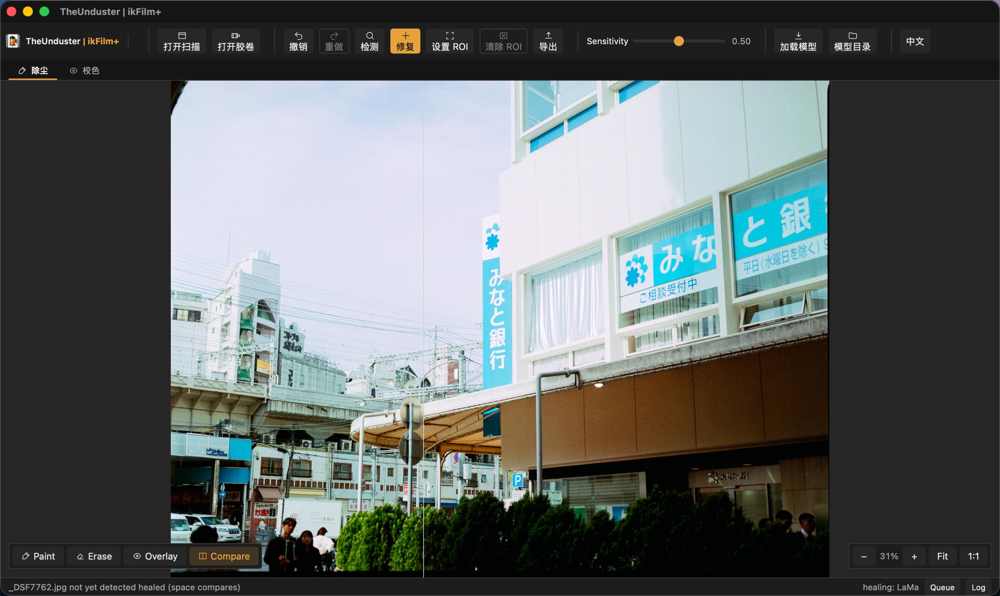

# TheUnduster ikFilm+

[](LICENSE)


TheUnduster is a macOS desktop app that finds and removes dust and scratches from scanned film. It's a Tauri 2 + Svelte 5 frontend over a Rust engine. Defect detection runs a neural network through ONNX and the healing path reconstructs defects in place using a separate inpainting model and grain synthesis.

See [docs/user-manual.md](docs/user-manual.md) for how to use the app.

> **Project status: the defect detector is not trained yet.**
> The app currently ships with a small *fixture* detector model used for
> development, not a model trained on real film. Detection will miss real dust
> and scratches until a proper model is trained on real data and passes the
> benchmark gate. Training that model is the biggest open piece of work — see
> [Models](#models) and [`training/`](training/README.md) below. Contributions
> of labelled scans and training help are especially welcome.

## Preview comparison

<table>
  <tr>
    <td width="50%" align="center">
      
      <br><sub>Original scan before ikFilm+ processing.</sub>
    </td>
    <td width="50%" align="center">
      
      <br><sub>Processed scan after ikFilm+ cleanup.</sub>
    </td>
  </tr>
</table>

## Screenshots

<table>
  <tr>
    <td width="50%" align="center">
      
      <br><sub>Detection marks dust and scratches with red circles.</sub>
    </td>
    <td width="50%" align="center">
      
      <br><sub>A roll is a folder of scans; the filmstrip tracks every frame.</sub>
    </td>
  </tr>
  <tr>
    <td width="50%" align="center">
      
      <br><sub>Before: detected defects, up close.</sub>
    </td>
    <td width="50%" align="center">
      
      <br><sub>After: the same area healed with LaMa inpainting.</sub>
    </td>
  </tr>
</table>

## Repository layout

- `app/` — the desktop app. `app/src/` is the Svelte 5 frontend (Viewer, Filmstrip, StatusBar, queue and log panels). `app/src-tauri/` is the Rust backend: roll and sidecar state, the job queue, model management, and scan processing.
- `engine/` — a Rust workspace of the crates the app is built on:
  - `fd-io` — decode/encode TIFF, PNG, JPEG at 8/16 bit into native-depth pixel buffers.
  - `fd-tiles` — display pyramids and a byte-bounded LRU tile cache.
  - `fd-infer` — tiled ONNX defect detection (512px tiles, 64px overlap, probability averaging).
  - `fd-heal` — tiered healing: classical median fill for small defects, ONNX inpainting plus grain re-synthesis for larger ones, with a bit-exactness guarantee outside the healed mask.
- `training/` — a separate Python/uv pipeline that harvests real defects, trains the detector, exports it to ONNX, and benchmarks it against a labelled roll. Nothing here ships in the app except the trained model itself.
- `docs/superpowers/` — design docs and implementation plans.

## Toolchain

Mise manages runtimes. Each part of the repo pins its own tools:

- `app/mise.toml` — Node 22, Rust stable
- `engine/mise.toml` — Rust stable
- `training/mise.toml` — Python 3.12, uv

Rust builds run through `cargo`, the frontend through `npm`, training through `uv`.

## Build and run

```bash
cd app && npm install && mise exec -- npm run tauri dev
```

Release build:

```bash
cd app && npm run tauri build
```

## Tests and gates

Rust workspace (from the repo root):

```bash
cargo test --workspace
cargo clippy --workspace --all-targets -- -D warnings
cargo fmt --all --check
```

Frontend (from `app/`):

```bash
npm run test
npm run check
```

Training (from `training/`):

```bash
uv run pytest
```

## Models

The healing model (LaMa, ONNX) is not bundled. The app downloads it on first use from a pinned Hugging Face revision and verifies it against a pinned SHA-256 before it's used (`app/src-tauri/src/model.rs`).

**The defect detector is not trained yet.** It currently ships as a fixture model for development, not a model trained on real film — see `training/DATA.md` for the data collection plan and `training/README.md` for the training flow.

## Working state per roll

When you open a roll (a folder of scans), the app keeps its working state next to your files, in a `.unduster/` directory inside that folder (`app/src-tauri/src/roll.rs`). This holds:

- `roll.json` — per-frame state: sensitivity threshold, approval/export flags, brush strokes, detected defect boxes.
- `thumbs/` — filmstrip thumbnails.
- `cache/` — cached detection probabilities (`.probs`) and healed-pixel deltas (`.heal`), each keyed to the source file's content and the model that produced them, so a changed file or a changed model produces a fresh cache entry.

Nothing here touches your original scan files. The app processes everything on
your machine — it never uploads your scans and sends no telemetry.

## Roadmap

Where the project is headed, roughly in priority order. None of this is fixed —
issues and discussion shape it, and help on any of it is welcome.

### Highest priority — needed before the app is genuinely useful

- **Train the real defect detector.** Replace the development fixture model with
  one trained on real film scans that passes the benchmark gate. This is the
  single biggest gap; see [`training/`](training/README.md) and `training/DATA.md`.

### Near-term

- **More formats and defect types.** Broaden file-format and bit-depth support,
  and extend detection beyond dust and scratches to defects like hairs, mold,
  and water spots.
- **Batch and workflow polish.** Faster batch processing, better export presets,
  richer undo/history, and general UX refinement.
- **Infrared (IR) channel handling.** Read the infrared channel that many film
  scanners capture alongside RGB (Digital ICE and similar), where dust and
  scratches show up directly because they block infrared. Use it as a defect
  mask to guide detection and healing, and support scans that ship an IR layer.

### Later — larger efforts

- **Broader platform support.** Beyond Apple Silicon macOS, bring builds to Intel
  Macs, Windows, and Linux.

## Contributing

Contributions are welcome, whether that's a bug report, a documentation fix, a
test scan, or code. Start with [CONTRIBUTING.md](CONTRIBUTING.md) for setup and
the checks to run, and please follow the [Code of Conduct](CODE_OF_CONDUCT.md).
Use [GitHub Issues](https://github.com/acornelissen/TheUnduster/issues) for bugs
and features, and [Discussions](https://github.com/acornelissen/TheUnduster/discussions)
for questions and ideas. To report a security problem, see
[SECURITY.md](SECURITY.md).

## License

TheUnduster is free software licensed under the
[GNU General Public License v3.0](LICENSE). You may use, study, share, and modify
it; if you distribute a modified version, it must stay under the same license.
